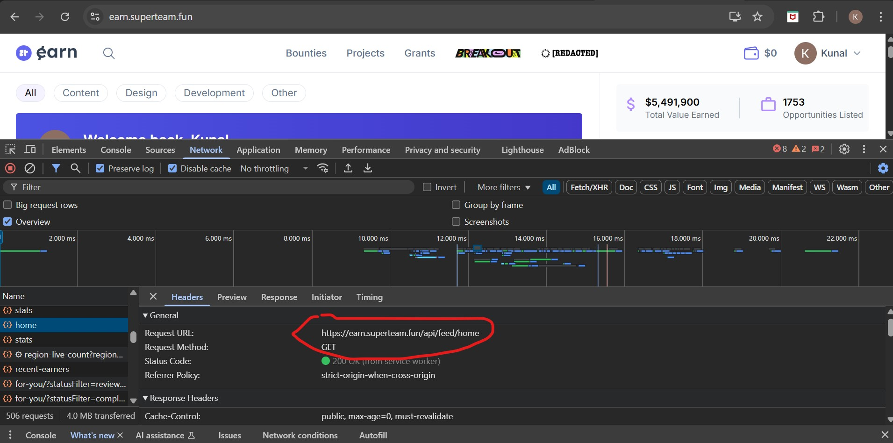
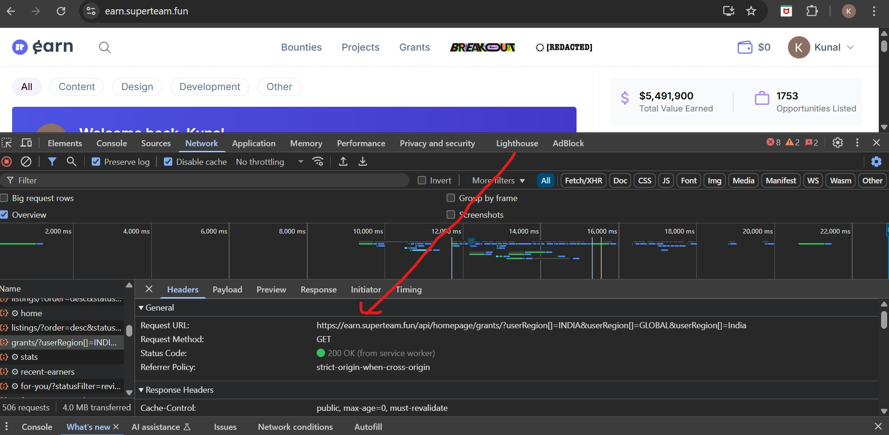
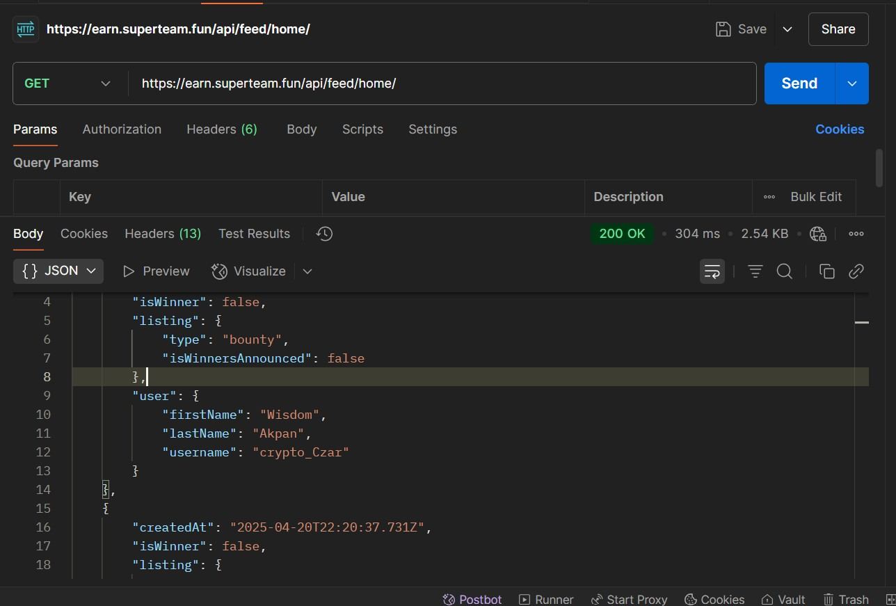
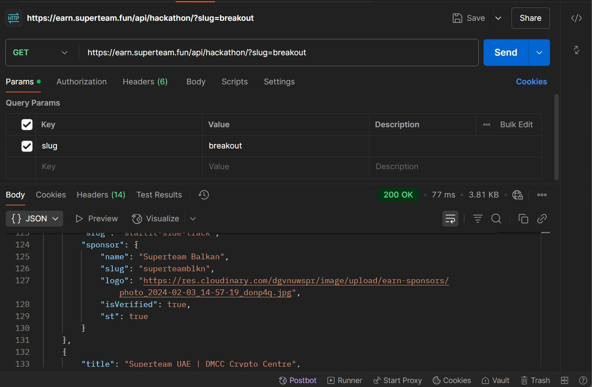
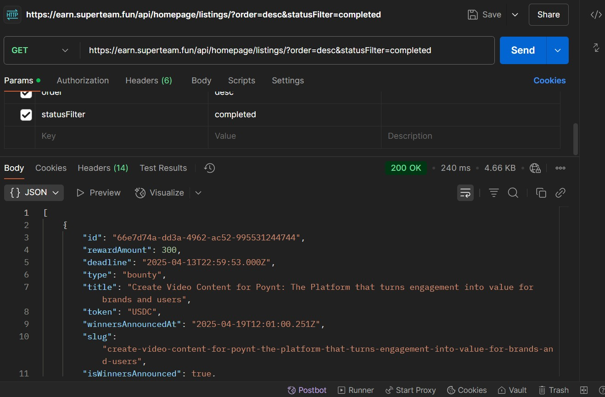
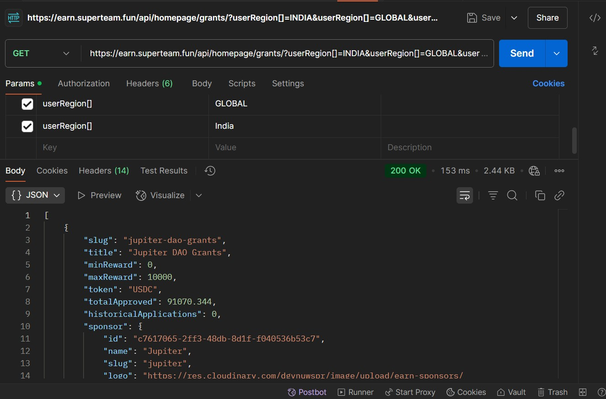
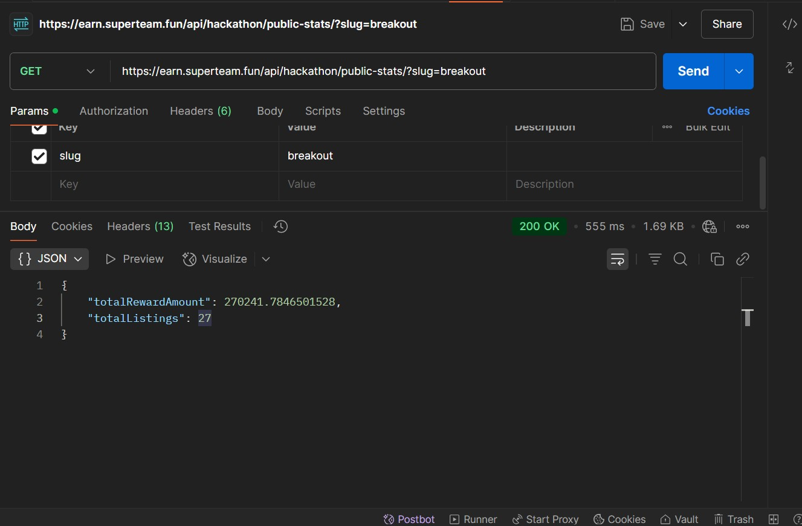
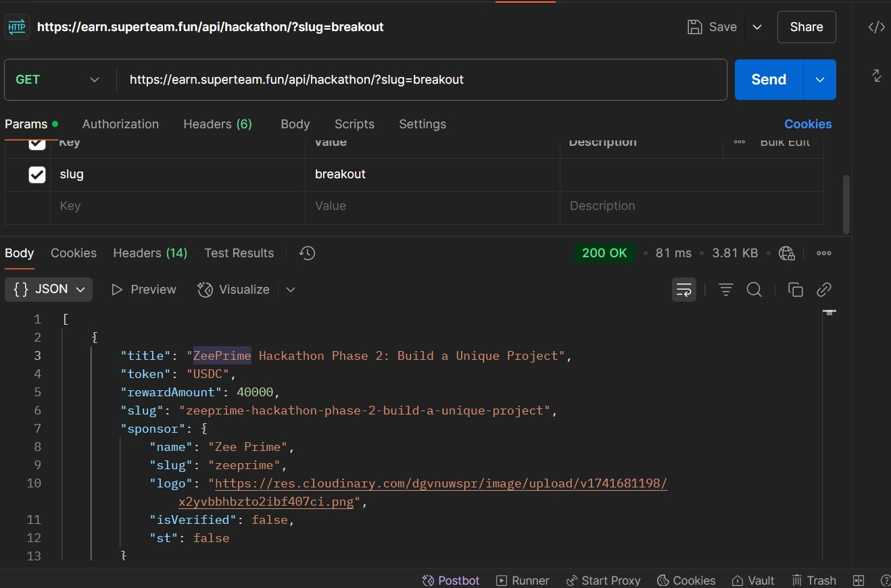

# 🔍 Exploring Superteam Earn Public APIs (For Educational Purposes Only)

This README documents publicly accessible APIs from the [Superteam Earn](https://earn.superteam.fun) platform. These endpoints were discovered using browser developer tools. This project is intended **strictly for educational purposes** — to understand how public APIs work, their potential vulnerabilities, and how developers can secure them.

---

## 📸 How APIs Were Found

Using the **Network tab** in browser DevTools, we can observe requests made when navigating the website. When actions like visiting a page or scrolling occur, network requests are triggered — and you can inspect those requests to see URLs, payloads, and responses.

### 📌 Screenshot: DevTools > Network > XHR or Fetch

📍 

---

## 📬 Sample API Requests & Responses

Below are examples of unauthenticated, publicly available APIs from Superteam Earn.

> You can test these directly in tools like **Postman** or **Insomnia**, no authentication is required.

### 📷 Screenshot: Postman with API Response Example

📍 

---

## 🧪 Observed Public APIs (So Far)

### 1. 🎯 Completed Listings

- **Endpoint:** https://earn.superteam.fun/api/homepage/listings/?order=desc&statusFilter=completed

- **Returns:** List of completed bounty projects with metadata like name, rewards, team, etc.
- **Response:** 

---

### 2. 🌏 Grants by Region

- **Endpoint:** https://earn.superteam.fun/api/homepage/grants/?userRegion[]=INDIA&userRegion[]=GLOBAL&userRegion[]=India

- **Returns:** List of completed bounty projects with metadata like name, rewards, team, etc.
- **Response:** 

---

### 3. 🧑‍💼 Recent Earners

- **Endpoint:** https://earn.superteam.fun/api/sidebar/recent-earners

- **Returns:** List of recent earners with usernames, profile icons, and task names.

---

### 4. 📰 Feed

- **Endpoint:** https://earn.superteam.fun/api/feed/home/
- **Returns:** Homepage feed containing recent and popular bounties.
- **Response:** 

### 5. 📊 Sidebar Stats

- **Endpoint:** https://earn.superteam.fun/api/sidebar/stats
- **Returns:** Key platform stats (e.g., total earners, total payouts).

---

### 6. 📍 Live Listings Count (Region-specific)

- **Endpoint:** https://earn.superteam.fun/api/listings/region-live-count?region=india
- **Returns:** Number of active listings by region.

---

### 7. 🧠 Hackathon Stats (Breakout Example)

- **Endpoint:** https://earn.superteam.fun/api/hackathon/public-stats/?slug=breakout
- **Response:** 

---

### 8. 🧑‍💻 Hackathon Details

- **Endpoint:** https://earn.superteam.fun/api/hackathon/?slug=breakout
- **Response:** 

---

### 🔍 There are likely more endpoints accessible on different pages — many follow REST-style naming conventions.

---

## 🚨 Why This Can Be Risky for Any Platform

These APIs are **unauthenticated and exposed**, which can lead to several risks:

### ❗ 1. Unrestricted Scraping

- No API keys or authentication means anyone can hit these endpoints.
- This allows third parties to scrape and clone data easily.

### ❗ 2. DDoS or Bot Attacks

- Without rate limiting, sending thousands or millions of requests could overload the server and **cause a denial of service**.

### ❗ 3. Resource Cost & Abuse

- If users hit the endpoints excessively using automated scripts or rotating IPs, it increases server and bandwidth costs.

---

## 🧠 But Wait — Just Because It’s Public Doesn’t Mean It’s Open to Abuse

Websites **often intentionally expose public APIs** for frontend rendering, but responsible usage is key.

Here’s what can go wrong if exploited:

| Type of Exploit         | Description                                | Consequence                 |
| ----------------------- | ------------------------------------------ | --------------------------- |
| Bot scraping            | Collecting user data in bulk               | Privacy breach, data resale |
| API spamming            | Rapid requests using scripts               | Server strain or crash      |
| IP rotation & flooding  | Rotating proxy IPs to bypass rate limits   | May slow or bring site down |
| Cloning entire platform | Using scraped data to create copycat sites | Brand and trust loss        |

---

## 🛡️ How Developers Can Secure Public APIs

If you're building a site like this, here are some **best practices to follow**:

### ✅ 1. Authentication

- Use JWT, OAuth, or API keys even for general content.
- Even basic auth reduces misuse.

### ✅ 2. Rate Limiting

- Tools like:
- `express-rate-limit` (Node.js)
- Cloudflare rules
- API Gateway throttling

### ✅ 3. Bot Detection

- Google reCAPTCHA, hCaptcha, or invisible bot scoring

### ✅ 4. IP Throttling

- Block known proxy services or cloud datacenter IPs.
- Allow burst control per IP.

### ✅ 5. Obfuscate or Proxy Critical APIs

- Don’t expose internal service endpoints directly on frontend.

---

## 💡 Educational Purpose & Disclaimer

This README and the findings here are purely for learning purposes. **No harmful actions were taken** nor recommended. If you're from the Superteam Earn team and want this taken down or modified, feel free to open an issue or email me.

> 💬 Always be the dev who understands security — not the one who breaks trust.

---

## 🙌 Final Thoughts

If you're a learner, ethical hacker, or web developer, use this as a case study to improve your understanding of:

- API design
- Security measures
- Responsible scraping
- Real-world web architecture

Let’s build **better**, not break what's working.

---

File=api-load-tester.js->

🧨 How This Script in File=api-load-tester.js Could Potentially Take Down the Site
If this script — or worse, a more aggressive version — were executed at scale, here's what could happen:

Overwhelming Server Resources (Denial of Service):

Each request consumes server CPU, memory, and database queries.

Sending thousands (or millions) of requests quickly can exhaust resources and slow down or crash the backend.

If multiple machines run this in parallel, it becomes a Distributed Denial-of-Service (DDoS) scenario.

Bandwidth Exhaustion:

APIs that return large JSON responses consume significant bandwidth.

High-volume traffic may increase hosting costs or exceed bandwidth limits, especially if responses are not cached efficiently.

Database Strain:

If the API fetches live data from a database (not cached), the DB server could be overwhelmed with thousands of read queries per second.

IP Bans or Cloudflare Blocks:

The website may eventually block the IP address making these requests.

If requests are routed via different proxies or VPNs, that detection becomes harder, potentially making it harder to mitigate.

Indirect Impact on Users:

Real users visiting the platform might experience slow loading, missing data, or complete site unavailability.

👻 If This Were Done Maliciously (Theoretically)
A malicious actor could:

Run this script from multiple IP addresses (botnet, proxies).

Target different endpoints in rotation to avoid easy detection.

Schedule periodic attacks (e.g. every minute, every hour) to cause intermittent downtime.

Use concurrent requests (e.g. 100 threads or Promise.all) to maximize throughput.
